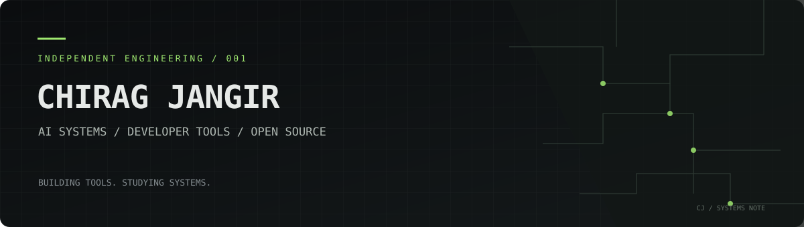

**Software, intelligence, and the layers beneath.**

I work across AI applications and developer tooling — exploring how systems behave, how they fail, and how small engineering changes make them more reliable.

[Projects](#selected-work) · [Open-source work](#open-source-work) · [Technical focus](#working-set)

---

## `01 / FIELD NOTES`

My interests sit at the intersection of **intelligent software** and the infrastructure around it: model integrations, developer workflows, observability, testing, and the details that make software dependable.

I prefer learning a codebase by tracing the behavior, reading the tests, and understanding the constraints before changing it. That approach shapes both my independent projects and my contributions to existing open-source tools.

<code>BACKGROUND</code>

B.Tech · Computer Science and Engineering (AI & ML)

## `02 / SELECTED WORK`

### [Cloud Vault](https://github.com/chiragjangiir/Cloud_Vault)

A web-based cloud-storage project focused on managing files through a browser interface.

`PROJECT` · `STORAGE` · `WEB`

The repository is the source of truth for the current implementation and setup instructions.

### Aadhaar enrolment & update analysis

An analytical project exploring patterns in Aadhaar enrolment and update activity with Python-based data workflows.

`PYTHON` · `PANDAS` · `DATA ANALYSIS`

The focus is on careful preprocessing, aggregation, and interpretation—not presenting exploratory analysis as a production system or a verified policy finding.

[Browse all repositories →](https://github.com/chiragjangiir?tab=repositories)

## `03 / OPEN-SOURCE WORK`

I contribute to existing projects by investigating specific problems and proposing focused changes. The links below point directly to the work; their current review and merge status is visible on GitHub.

| Project | Contribution | Focus |
|---|---|---|
| [OpenLLMetry #4540](https://github.com/traceloop/openllmetry/pull/4540) | `test(watsonx): redact API keys in VCR cassettes` | Test hygiene · Sensitive-data handling |
| [MoneyPrinterTurbo #1581](https://github.com/harry0703/MoneyPrinterTurbo/pull/1581) | `feat(llm): add local OpenCode CLI provider with dynamic model discovery` | LLM integrations · Local developer tooling |
| [Java Docs Samples](https://github.com/GoogleCloudPlatform/java-docs-samples) | Documentation improvements: product-level READMEs and documentation corrections | Developer experience · Documentation |

## `04 / WORKING SET`

**AI & model applications**  
LLM integrations · RAG concepts · AI agents · machine learning · data analysis

**Developer tooling**  
CLI workflows · APIs · debugging · testing · observability · developer experience

**Languages & foundations**  
Python · Java · C++ · JavaScript · SQL · Git

**Libraries & tools**  
NumPy · Pandas · scikit-learn · Matplotlib · Jupyter · Docker · Vercel

This is a map of the areas I work in, not a claim of equal depth across every tool.

## `05 / PRINCIPLES`

- **Understand before changing.** Read the surrounding code and tests before proposing a fix.
- **Prefer evidence over theater.** Reproducible behavior matters more than impressive labels.
- **Keep the surface small.** Focused changes are easier to review, test, and maintain.
- **Build in the open.** Useful software improves through clear documentation and thoughtful review.

---

`INDEPENDENT ENGINEERING` &nbsp; / &nbsp; `AI SYSTEMS` &nbsp; / &nbsp; `OPEN SOURCE`

[GitHub](https://github.com/chiragjangiir) · [Repositories](https://github.com/chiragjangiir?tab=repositories)

Interested in practical AI, developer infrastructure, and open-source work that solves a real problem.

